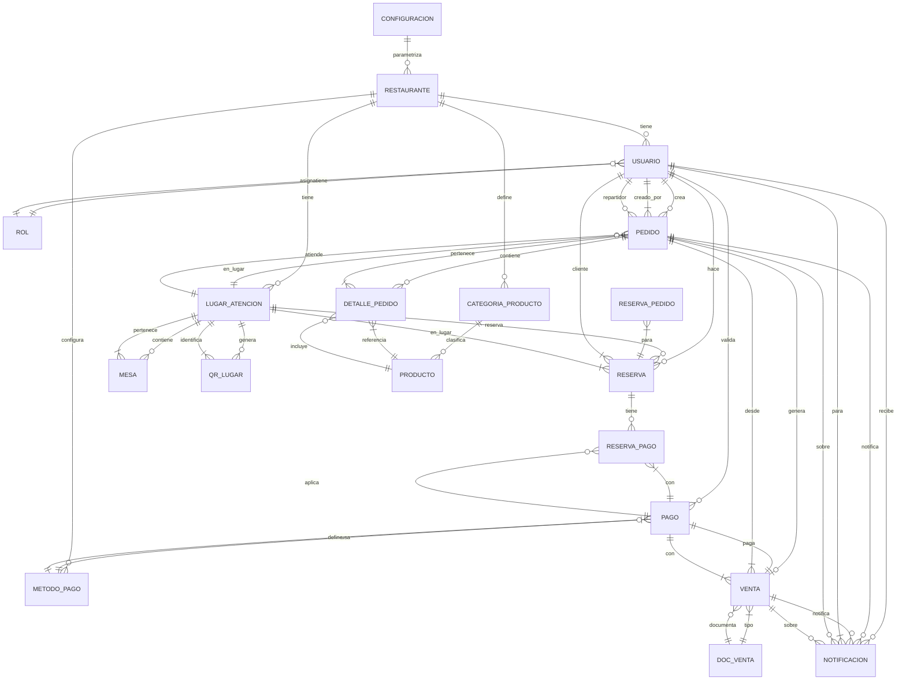

# Requerimientos del Sistema de Restaurante

## 1. Visión General

Sistema integral de gestión para restaurante que incluye: autenticación, onboarding, gestión de usuarios, mesas/QR, productos, pedidos (mesa y delivery), pagos, reservas, ventas, facturación, cocina, contabilidad, delivery, notificaciones y reportes.

---

## 2. Módulos Funcionales

### Bloque 1 - Fundamentos
- **Autenticación**: Login, registro, JWT, roles y permisos
- **Onboarding**: Configuración inicial del restaurante
- **Configuración**: Parámetros del sistema
- **Usuario**: Gestión de usuarios y roles
- **Lugar de Atención**: Mesas, salones, zonas delivery
- **Mesas-QR**: Generación y gestión de códigos QR

### Bloque 2 - Operaciones Core
- **Categoría Producto**: Clasificación de productos
- **Producto**: Catálogo con precios y stock
- **Pedido**: Órdenes MESA y DELIVERY con estados
- **Pago**: Métodos y procesamiento de pagos
- **Reserva**: Gestión de reservas con adelantos

### Bloque 3 - Cierre y Análisis
- **Venta**: Generación de ventas desde pedidos pagados
- **Notificación**: Sistema de alertas en tiempo real
- **Cocina**: Cola de preparación y tiempos
- **Contabilidad**: Cierres de caja y reportes contables
- **Delivery**: Seguimiento de repartidores
- **Facturación**: Emisión de boletas/facturas
- **Reportes**: Dashboards y métricas

---

## 3. Actores del Sistema

| Actor | Descripción | Accesos |
|-------|-------------|---------|
| **Cliente Público** | Sin login, escanea QR | Menú público, crear pedidos MESA |
| **Mesero** | App interna | Gestión mesas, pedidos, cobro |
| **Cocina** | Panel cocina | Cola pedidos, estados preparación |
| **Repartidor** | App delivery | Pedidos EN_CAMINO, entrega |
| **Admin/Operador** | Panel admin | Todo el sistema, reportes |
| **Contabilidad** | Solo reportes | Cierres, ventas, impuestos |

---

## 4. Requerimientos No Funcionales

- **Seguridad**: JWT 24h, BCrypt, roles (ADMIN, MESERO, COCINA, REPARTIDOR, CONTABILIDAD)
- **Concurrencia**: Optimistic locking en Pedido
- **Tiempo Real**: WebSocket/SSE para cocina y mesero
- **Offline**: Service Worker para menú público
- **Auditoría**: Log de cambios de estado (quién, cuándo, antes/después)
- **Performance**: Índices en FKs, estado, fecha, tipo

---

## 5. Diagrama Entidad-Relación (Solo Entidades)



### Entidades Principales (18)

1. **Restaurante** - Configuración global del negocio
2. **Rol** - Perfiles de acceso (ADMIN, MESERO, COCINA, REPARTIDOR, CONTABILIDAD, CLIENTE)
3. **Usuario** - Empleados y repartidores del sistema
4. **LugarAtencion** - Mesas, salones, zonas delivery, barra
5. **Mesa** - Mesas físicas con capacidad y estado
6. **QRLugar** - Códigos QR por mesa para menú público
7. **CategoriaProducto** - Clasificaciones del menú
8. **Producto** - Ítems del menú con precio y stock
9. **Pedido** - Órdenes MESA/DELIVERY/RECOJO
10. **DetallePedido** - Líneas de pedido con precio congelado
11. **Reserva** - Reservas de mesa con adelanto
12. **ReservaPago** - Vinculo reserva-pago con montos
13. **MetodoPago** - Efectivo, tarjeta, Yape, Plin, transferencia
14. **Pago** - Transacciones de pago
15. **DocVenta** - Tipos: boleta, factura, ticket
16. **Venta** - Cierre contable de pedido pagado
17. **Notificacion** - Alertas push/in-app
18. **Configuracion** - Parámetros clave-valor del sistema

---

## 6. Flujo Principal de Datos

```
CLIENTE (QR) → MENÚ PÚBLICO → CARRITO → PEDIDO (PENDIENTE)
                                    ↓
                            COCINA (EN_PREPARACIÓN → LISTO)
                                    ↓
                            MESERO/REPARTIDOR (ENTREGADO)
                                    ↓
                            CAJA (PAGO) → VENTA + DOC_VENTA
                                    ↓
                            CONTABILIDAD / REPORTES
```

---

## 7. Estados Críticos

### Pedido (MESA)
`PENDIENTE → EN_PREPARACION → LISTO → ENTREGADO → PAGADO`

### Pedido (DELIVERY)
`PENDIENTE → CONFIRMADO → EN_PREPARACION → LISTO → EN_CAMINO → ENTREGADO → PAGADO`

### Reserva
`PENDIENTE → CONFIRMADA → COMPLETADA | CANCELADA`

### Pago
`PENDIENTE → APROBADO | RECHAZADO | REEMBOLSADO`

### Venta
`CERRADA | ANULADA`

---

## 8. APIs Principales

| Módulo | Endpoints Clave |
|--------|-----------------|
| Auth | POST /auth/login, POST /auth/register |
| Lugares | GET /lugares, POST /lugares, GET /lugares/qr/:id |
| Productos | GET /productos, POST /productos, PUT /productos/:id |
| Pedidos | POST /pedidos, GET /pedidos, PUT /pedidos/:id/estado |
| Pagos | POST /pagos, GET /pagos, PUT /pagos/:id/validar |
| Reservas | POST /reservas, GET /reservas/disponibilidad |
| Ventas | GET /ventas, GET /ventas/cierre-caja |
| Reportes | GET /reportes/ventas, GET /reportes/pedidos |

---

## 9. Base de Datos

- **Motor**: PostgreSQL
- **ORM**: Hibernate/JPA (Spring Data JPA)
- **Migración**: ddl-auto=update (desarrollo), Flyway (producción)
- **Conexión**: HikariCP pool

---

## 10. Despliegue

- **Backend**: Spring Boot 3.x (Java 17+)
- **Frontend**: Angular 17+
- **BD**: PostgreSQL 15+
- **Contenedores**: Docker Compose
- **Proxy**: Nginx (opcional)

---

*Documento vivo - Actualizar según evolución del proyecto*